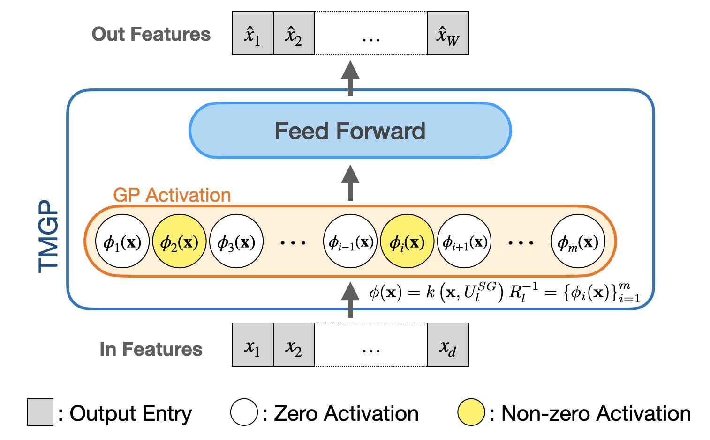

************
Sparse Deep Gaussian Process
************

Deep GPs as neural networks
===================

A GP :math:`\mathcal{G}` is defined by the mean and covariance function :math:`\mu(\cdot)` and :math:`k(\cdot, \cdot')`,
respectively. A :math:`H`-layer DGP :math:`f` is defined by the composition of :math:`H` multi-variate GPs as follows:

.. math:: f(\cdot) = \mathcal{G}^{(H)} \circ \cdots \circ \mathcal{G}^{(2)} \circ \mathcal{G}^{(1)}(\cdot),

where :math:`f \circ g` denotes the composition
function :math:`f(g(\cdot))`. Each layer :math:`\mathcal{G}^{(i)}` is a GP with mean function :math:`\mu^{(i)}(\cdot)`
and kernel function :math:`k^{(i)}(\cdot, \cdot')`, :math:`i=1,\ldots,H`. The input of the first layer is the input of
the DGP, and the output of the :math:`i`-th layer is the input of the :math:`(i+1)`-th layer. The output of the
:math:`H`-th layer is the output of the DGP.

We approximate GP :math:`\mathcal{G}^{(i)}` by the finite-rank approximation as a one-layer neural network:

.. math:: \begin{align*} \hat{\mathcal{G}}^{(i)}(\cdot) := & \mu + k(\cdot, \mathbf{U}) [ k(\mathbf{U}, \mathbf{U})]^{-1} \mathcal{G}^{(i)}(\mathbf{U}), \\ = & \mu + k(\cdot, \mathbf{U}) R^{-1}_{\mathbf{U}} \mathbf{Z} \\ = & \mu + \phi^{T}(\cdot) \mathbf{Z} \end{align*}

where :math:`\mathbf{U}=\{ \mathbf{u}_i \}_{i=1}^{m}` are the inducing points. :math:`R_{\mathbf{U}}` is the Cholesky
decomposition of the kernel matrix :math:`k(\mathbf{U}, \mathbf{U})`,
and :math:`\mathbf{Z} = [R^{T}_{\mathbf{U}}]^-1 \mathcal{G}(\mathbf{U})` are independently distributed
weights. :math:`\phi(\cdot) = k(\cdot, \mathbf{U}) R^{-1}_{\mathbf{U}}` is the activation feature map.

.. note::
    This notebook is not necessarily intended to teach the mathematical background of
    sparse DGPs, but to provide a simple tutorial of how to use Sparse DGP module in machine learning applications. For a
    mathematical treatment of sparse DGPs, please refer to the original paper: `A Sparse Expansion For Deep Gaussian Processes`_.

.. _A Sparse Expansion For Deep Gaussian Processes: https://arxiv.org/pdf/2112.05888

Deep GPs with the sparse grid
===================

Sparse grid
-----------------------
Inducing points :math:`\mathbf{U}^{SG}_l` are selected on a level-:math:`l` sparse grid. A sparse grid is a set of grid points
in a d-dimensional input space.

Deep Tensor Markov GP (DTMGP)
-----------------------
Deep Tensor Markov GP (DTMGP) is a DGP with the sparse grid structure and Markov kernel. The hidden layer
architecture of DTMGP is as follows:

Deep GPs with the additive structure
===================
Deep Additive Markov GP (DAMGP) is a DGP with the additive structure and Markov kernel. Each layer is a composition of
GPs with 1-D sparse grid. The hidden layer architecture of DAMGP is as follows:

